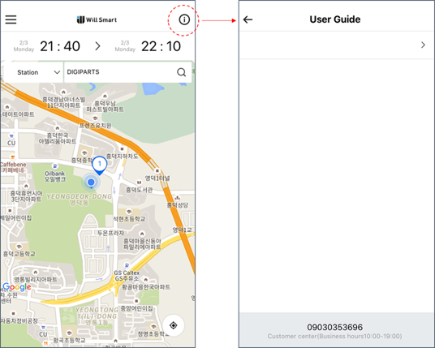

## 기업정보관리

### 유저앱에  표시되는  기본적인  정보들을  관리하는  방법

서비스명과  서비스로고를  등록하기, 사업장  주소  및  고객센터  등록, 소수점  처리  정책을  관리할  수  있습니다.

-   기업정보

	-   유저앱에  표시되는  서비스의  기본적인  정보들을  기입해주세요.
	-   서비스명과  서비스  로고를  등록하는  방법
	-   서비스명 : 입력한  서비스  명은  사용자에게  발송되는  알림에  표시됩니다.
	-   서비스로고 : 서비스로고를  규격에  맞게  등록합니다. 등록한  서비스  로고는  유저앱  맨  상단에  표시됩니다.
	-   지도의  기본  위치를  설정하는  방법
	-   사업장  주소 : 입력한  사업장  주소는  사용자가  유저  앱에서  위치  정보  제공을  동의하지  않은  경우  지도에  기본  위치로  표시됩니다.
	-   고객센터  전화  번호를  수정하는  방법
	-   사고접수  전화번호 : 스마트키의  사고접수  화면에  표시됩니다.
	-   고객센터  운영시간/전화번호 : 고객센터  전화번호는  서비스  운영회사  단위로  관리됩니다.
	-   면허  승인대기  일수를  수정하는  방법
	-   면허  승인대기일 : 사용자가  면허를  등록하거나  수정할경우  표시되는  승인까지  소요되는  기간입니다.

-   과금정책관리

	-   소수점  이하  자리의  숫자를  처리하는  방법
	-   시스템  내에서  비율에  따라  금액이  계산되는  부분은  취소정책  수수료와  포인트  적립 2가지가  있습니다.
	-   2가지  각각에  대하여  소수점이하  자리의  숫자를  어떻게  처리할지에  대한  반올림  정책을  결정할  수  있습니다.

### 이용가이드에  글을  등록하는  방법

> 기업정보관리 > 추가  정보  영역

-   추가  정보  영역에  글을  등록하면  사용자앱의  이용가이드에  표시됩니다.

## 배너  관리

유저앱에  표시되는  커스텀  이미지를  관리합니다.
각  이미지는  규격에  맞게  업로드  해주세요.

### Splash 배너를  수정하는  방법

-   이미지  규격 (1440*2560px)에  맞는  이미지를  준비합니다.
-   이미지를  업로드  합니다.
-   비사용을  선택하면  기본  이미지가  표시됩니다.

### 로그인  배너를  수정하는  방법

-   이미지  규격 (1440*800px)에  맞는  이미지를  준비합니다.
-   이미지를  업로드  합니다.
-   비사용을  선택하면  기본  이미지가  표시됩니다.

### 패널티  정보를  수정하는  방법

-   이미지  규격 (가로 1440px)에  맞는  이미지를  준비합니다.
-   이미지를  업로드  합니다.
-   비사용을  선택하면  기본  이미지가  표시됩니다.

### 차량  반납  조건을  수정하는  방법

-   이미지  규격 (가로 1440px)에  맞는  이미지를  준비합니다.
-   이미지를  업로드  합니다.
-   비사용을  선택하면  기본  이미지가  표시됩니다.

## 알림메일  관리

### 사용자에게  발송되는  알림을  수정하는  방법

-   알림메일  관리에서는  상황에  따라  사용자에게  발송되는  알림을  관리할  수  있습니다.
-   이메일과  스마트폰  푸시알림  두가지가  제공됩니다.
-   기본  내용이  제공되며  입력안내의  각  필드를  활용해  내용을  수정할  수  있습니다

## 약관관리

유저앱에서  표시되는  약관들을  관리합니다. 유저앱의  아래  각  단계(화면)에서  약관이  표시됩니다.

1.  회원가입: 유저  회원가입시  동의가  필요한  약관. 다중  등록  가능.
2.  탈퇴: 유저의  서비스  탈퇴  시  동의가  필요한  약관. 하나만  등록  가능
3.  환경설정 : 환경설정  약관이  표시되는  약관. 다중  등록  가능.
4.  대여: 유저가  차량을  대여할  때마다  반드시  동의해야하는  약관. 하나만  등록  가능

-   기본정보를  입력합니다.

	-   약관유형 : 약관  동의의  필수/선택  여부를  선택합니다.
	-   화면타입선택 : 회원가입/탈퇴/대여/환경설정  중  택일합니다. 탈퇴와  대여  약관은  하나만  등록  가능합니다.
	-   동의조건 : 약관  동의  시, 약관  내용의  확인  여부를  선택합니다. ‘내용  확인’을  선택하면  유저는  약관의  내용을  읽고  하단의 ‘확인’버튼을  눌러야만  약관에  동의할  수  있습니다.

-   약관  이력  관리

	-   약관이  개정되는  경우 ‘약관  추가’ 버튼을  눌러  계속적으로  약관을  등록할  수  있으며, 등록시마다  적용일을  선택할  수  있습니다.

## FAQ관리

유저앱>마이페이지>FAQ에  표시되는  질문들을  관리합니다.

### 신규 FAQ를  등록하는  방법

> 게시판관리 > FAQ관리 > 신규등록

-   ‘신규등록’을  클릭합니다.
-   카테고리를  선택합니다.
-   제목과  내용을  입력하고 ‘등록’을  클릭합니다.
-   대표 FAQ로  지정하면 FAQ의  메인페이지에  표시됩니다.

### FAQ 카테고리를  등록하는  방법

-   FAQ를  신규등록  하기전 ‘카테고리관리’에서 FAQ의  카테고리를  추가합니다.
-   ‘카테고리  추가’를  클릭하면  빈  필드가  생성됩니다.
-   해당  필드에  카테고리명을  입력하고 ‘저장’을  누릅니다.

### FAQ를  삭제하는  방법

-   삭제하려는 FAQ를  선택해 FAQ 상세페이지로  이동합니다.
-   우측  하단의 ‘삭제’를  클릭합니다.
-   데이터는  삭제하지  않고, 사용자에게  표시되지  않도록만  하고  싶다면  좌측의 ‘비사용’을  선택합니다.
